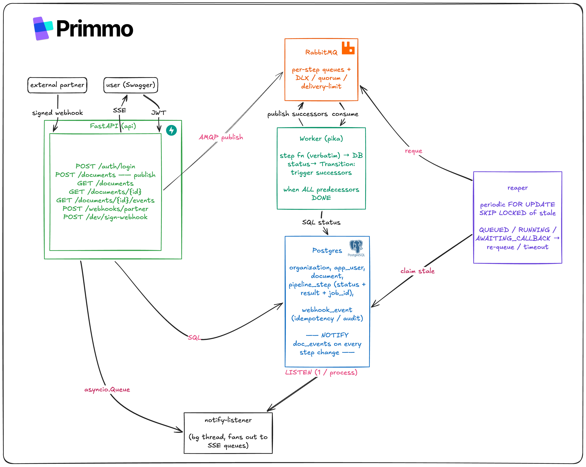

# Design & trade-offs

This document explains the reasoning behind the implementation: what the assignment asks
for, how the system is put together, the decisions I made and why, and a closer look
at the few parts that carry real risk. The README covers how to run it; this is the
rationale.

The single idea that drives most of the design: durable state lives in Postgres, and
the message broker is only a transient delivery pipe. Progress, retries, and results
are all rows in one database, and that same database is what the realtime feed reads
from. Almost every other decision below follows from that.

---

## Part 1. Requirements

### Restated

A multi-tenant API. An authenticated user who belongs to an organization uploads a
file into their org's space, which starts a fixed four-stage pipeline (OCR →
{metadata, chunking} → external_call). The last stage hands the document to an
external partner that replies asynchronously through a signed webhook, and the
document is only `ready` once that webhook has been received and verified. Users can
watch progress with roughly one-second latency, read the extracted data when it is
done, and list their organization's documents. Tenants are isolated throughout. The
whole thing boots with `docker compose up`, is exercisable from `/docs`, and ships
seeded with two organizations.

### What the assignment asks for explicitly

Upload a file, track progress (about one second, every step change reported), fetch
the extracted data, and list an org's documents with name, importing user, and
status. An inbound partner webhook whose HMAC signature is verified before anything
is processed. JWT auth and tenant isolation. The fixed pipeline DAG, with the
provided step functions used verbatim. The `ready` state gated on the verified
webhook, and a way to compute a valid signature so the webhook is testable from
`/docs`. Finally, `docker compose up` with seeding and a README of the choices.

### Implicit requirements

- **Retries are the actual point.** With a one-in-three failure rate per step, a
  pipeline with no retries succeeds only `(2/3)⁴ ≈ 20%` of the time. "Don't change
  the failure rate" is the assignment telling you that handling failure is what matters.
- **Fan-in has to fire exactly once.** metadata and chunking finish concurrently, and
  external_call must be triggered once: not zero times, not twice.
- **The webhook must be idempotent.** Partners retry the same `job_id`, so a replay
  has to be a no-op.
- **Status lives at two levels.** Per-step status for the feed, and a derived
  document-level status for the list view and the `ready` gate.
- **Crashes and lost messages must not strand a document.** A dead worker or a publish
  that never landed has to be recoverable.
- **The webhook is unauthenticated but still safe.** There is no user JWT on it, so
  the tenant has to be resolved server-side without trusting the caller.

### Assumptions I resolved rather than asked

The assignment is self-contained, so where it left a small gap I picked an answer and
wrote it down.

- **File parsing** — not done; the bytes are persisted through a `Storage` interface
  (local disk now, GCS or S3 behind the same interface) and never read, with `storage_uri`
  holding a scheme-qualified URI.
- **"Extracted data"** — the aggregate of the step outputs (OCR text, metadata, chunks,
  partner result), exposed only once the document is `ready`.
- **Webhook `status` values** — `completed` marks the document ready and `failed` marks it
  failed; anything else is rejected.
- **Login** — a dev `POST /auth/login` that issues an HS256 JWT for a seeded email;
  production would use RS256 with JWKS.
- **Partner secret scope** — a single platform-wide `PARTNER_HMAC_SECRET`; per-partner keys
  are an obvious later step.
- **Retry budget** — up to five attempts per step via broker redelivery, after which the
  step errors and the document fails.

### A few coverage notes

SSE can't really be driven from Swagger, since the page just hangs on a live stream.
So progress is also observable through the pollable `GET /documents/{id}`, which means
the full flow works inside `/docs` while SSE remains the production transport (shown
with `curl`). That polling path doubles as the fallback the transport question
expects. Both scale points are addressed: today's load is trivial, and the design's
job is to not fall apart on the way to 100k documents a day. The HMAC is computed over
the raw request bytes and checked before parsing, because re-serializing the JSON
would change the bytes and break the signature.

---

## Part 2. Architecture



### The end-to-end flow

Client routes live under a `/v1/docpipe` prefix (for example `/v1/docpipe/documents`),
while `/healthz` is unversioned. The steps below drop the prefix for readability.

1. `POST /documents` stores the bytes, creates the `document` plus four `pipeline_step`
   rows (ocr QUEUED, the rest PENDING), publishes `ocr`, and returns `201 {id,
   processing}`.
2. The worker moves `ocr` to RUNNING (with a NOTIFY), runs `ocr()`, then marks it DONE
   with its text. The transition logic sees that metadata and chunking now have all
   their predecessors done and publishes both.
3. metadata and chunking run in parallel and each finish DONE. When the second one
   finishes, external_call's predecessors are all done, so an atomic
   `UPDATE … WHERE status='pending' RETURNING` flips it to QUEUED exactly once and
   publishes it.
4. The worker runs `external_call()`, gets a `job_id`, moves the step to
   AWAITING_CALLBACK, and stores the `external_job_id`. The document stays
   `processing`.
5. The partner calls `POST /webhooks/partner`. We verify the HMAC over the raw bytes
   in constant time, record a `webhook_event`, mark external_call DONE with its result,
   and the document becomes `ready`.
6. SSE emits a message on each NOTIFY, and `GET /documents/{id}` returns the extracted
   data.

### Data model

- **organization**(id, name) and **app_user**(id, org_id, email).
- **document**(id, org_id, uploaded_by, filename, storage_uri, status, timestamps).
- **pipeline_step**(id, document_id, name, status, attempts, result JSONB, error_text,
  external_job_id, timestamps). It has a `unique(document_id, name)` constraint, an
  index on `external_job_id`, and a partial index on the in-flight statuses that keeps
  the reaper's scan small. The document table is indexed on `(org_id, created_at)`.
- **webhook_event**(id, job_id, signature_ok, payload JSONB, timestamps), append-only.

Document status is derived from the step rows, which are the single source of truth,
but it is also stored so the list view stays a cheap single-table read. Only the
transition logic writes it, and always in the same transaction as the step change that
caused it.

### Module boundaries

The dependency graph lives in exactly one place, `pipeline/dag.py`, so adding a fifth
step is a data change rather than a rewrite of the control flow. The transitioner
consults only that graph to decide what runs next.

---

## Part 3. Decision log

1. FastAPI, which was imposed: async for SSE, pydantic v2, and a free `/docs`.
2. RabbitMQ with custom pika workers rather than Celery (dive A).
3. Sync SQLAlchemy, with async reserved for SSE (dive E).
4. SSE over Postgres LISTEN/NOTIFY, fanned out per process (dive B).
5. Retries handled by the broker (DLX plus a delivery limit), then a terminal error (dive F).
6. Exactly-once fan-in through an atomic conditional UPDATE (dive C).
7. Commit-then-publish backed by a reaper, rather than a full outbox for now (dive D).
8. HS256 JWT with an org claim and a dev login, over a shared-schema tenancy model (dive G).
9. Webhook verified before processing, and idempotent on replay (dive H).

### Left out on purpose

To keep the solution scoped to the exercise I did not build real file parsing, a real
identity provider with refresh tokens, fine-grained RBAC, API rate limiting,
cross-process SSE fan-out, a transactional outbox, schema-per-tenant isolation, RLS,
or full Sentry/Datadog wiring (the structured logging already carries the context to plug
one in). No UI and no CI/CD,
both of which the assignment excludes.

---

## Part 4. Deep dives

### A. Custom pika workers instead of Celery

The reason comes back to where state lives. The `pipeline_step` rows are the single
source of truth, and Celery wants a result backend, which is a second place state can
live and therefore a second place it can drift. Here the fan-in is a SQL transaction
that is easy to reason about and atomic with the result, the results already sit in
`pipeline_step.result` so there is no backend to keep in sync, and the broker's
reliability controls (quorum queues, DLX, a delivery limit, prefetch of one) are
exposed directly. What I gave up is real: Celery would hand me the DAG and retries for
less code and bring a mature ecosystem with it (Flower, beat). For four fixed steps
that trade saves maybe fifty lines while adding a result backend and chord-reliability
concerns, which nets out negative here. I would reach for Celery, Temporal, or Airflow
the moment the DAG grows large or dynamic, the task types get heterogeneous, or
scheduled jobs enter the picture.

Because the orchestration is deliberately thin, it is also portable. Dispatch is the
only part that is broker-specific: enqueueing lives in `publisher.py` and consuming in
the worker entry point, while the handler registry, the transitioner, and the DAG know
nothing about the transport. On Celery the publish becomes `step.delay(...)` and the
worker runs with `acks_late` and a prefetch of one, on Google Cloud Tasks each step
becomes an authenticated POST to an internal endpoint and the broker disappears
entirely, at the cost of the prefetch and quorum controls. The parts that make the
system correct, Postgres as the source of truth, the atomic fan-in, the reaper, do
not change under any of these. It is worth noting that the reaper is still needed on Celery
or Cloud Tasks: neither recovers a step that committed but whose enqueue was lost, and
nothing but the reaper covers a partner that never calls back.

### B. SSE over LISTEN/NOTIFY with per-process fan-out

Each API process opens one dedicated connection that LISTENs on `doc_events`, and
workers call `pg_notify(...)` inside the status transaction so the notification fires
on commit. Every process receives every event and filters in memory down to its own
SSE clients, which means the number of database connections scales with processes
(around ten) rather than with clients (five thousand). A few details matter here. The
NOTIFY payload is capped near 8 KB, so the events are kept thin and the client
re-fetches detail when it needs it. The client subscribes before the snapshot is
taken, so no delta is lost in the gap between the two. Durability is not a concern
because the database is the log and the snapshot sent on connect or reconnect is
authoritative. And since psycopg2's LISTEN is poll-based, the listener runs on a
background thread that pushes into asyncio queues.

Those per-client queues are bounded. A slow or stuck consumer's queue fills up and
further deltas are dropped and counted rather than accumulated without limit, which is
safe precisely because the snapshot on reconnect is authoritative and the client
resyncs. One known gap: the listener thread does not yet recover on its own if the
LISTEN connection drops (a database restart or a network blip), and a production
version would wrap the connect-listen-poll loop in a reconnect with backoff.

The point where this approach stops paying off is when events times processes gets
expensive, at which point a Redis pub/sub or a RabbitMQ topic exchange takes over the
fan-out. WebSocket would only be worth it if the traffic became bidirectional.

### C. Exactly-once fan-in

The race is metadata and chunking finishing at the same time, with both trying to
trigger external_call. The trigger is
`UPDATE pipeline_step SET status='queued' WHERE name='external_call' AND
status='pending' RETURNING id`, which is atomic and lock-free, so only the transaction
that wins the row publishes. Each finisher commits its own DONE before it triggers, so
the other one sees it, the atomic claim gives at-most-once and that ordering gives
at-least-once, which together are exactly once. A concurrency test that runs both
finishers on separate connections covers this.

### D. Reaper versus a transactional outbox

These solve different failures, which is the key thing to be clear about. If a worker
crashes mid-step and never acks, RabbitMQ redelivery handles it (prefetch one, ack after
commit). If the commit succeeds but the publish is lost, leaving a QUEUED step with no
message in the broker — either the reaper or an outbox would recover it. And if
external_call succeeds but the partner never calls back, leaving the step in
AWAITING_CALLBACK forever, only the reaper can rescue it.

The reaper is mandatory because it is the only thing that covers the partner timeout;
an outbox is an optional refinement that would close the publish gap. The reaper
claims stale rows with `FOR UPDATE SKIP LOCKED`, which is safe to run from several
reapers at once with no leader election, and it only touches rows older than a timeout
set well above the maximum step duration. It re-publishes stale QUEUED steps but
leaves RUNNING ones to broker redelivery, so it never causes a second external_call
side effect.

### E. The sync/async split

Async gets you one thread and an event loop handling thousands of awaits, but only as
long as nothing blocks the loop. FastAPI runs plain `def` routes in a threadpool, one
thread per in-flight request, and `async def` routes on the loop. SSE streams are
long-lived, so they have to be `async def`: five thousand idle streams are just parked
coroutines, whereas as sync routes they would exhaust the threadpool. The database
layer stays sync, since the workers block on `time.sleep` anyway, and the SSE endpoint
bridges its one snapshot read through `run_in_executor`. The threadpool, the
SQLAlchemy pool, and Postgres `max_connections` have to be sized together, as one
chain. If the API tier itself became the bottleneck under high request rates, the move
would be async SQLAlchemy on asyncpg.

### F. Retries and idempotency

Brokers deliver at least once, so "exactly once" really means at-least-once delivery
plus idempotent processing. Broker-level retries, redelivery, a delivery limit, and a
DLX, beat an in-code backoff loop, because a loop holds the worker slot while it
sleeps. The handlers are idempotent: a step already DONE is skipped, and the fan-in is
the conditional UPDATE from dive C. For the three pure-compute steps that is enough,
because they only ever write to our own database — running one a second time just
rewrites the same row, so a redelivery does no harm.

external_call is the exception, and the one real hazard, because it has an external
side effect: it calls a third-party partner, which we cannot undo. The ordering rule
everywhere is **commit the result, then ack the message**. That guarantees we never
lose a step, if the worker dies before committing, the message is redelivered and we
retry. The price is that the guarantee is at-least-once, not at-most-once: if
external_call reaches the partner and the worker then crashes in the small window before
it commits the returned `job_id`, the redelivery calls the partner again and creates a
duplicate job. So we never under-deliver, but in that rare window we can over-deliver.

The clean fix is an **idempotency key**: generate one per step and send it with the call,
so the partner folds a retry into the same job instead of creating a new one. That closes
the window entirely; it is the production answer, listed under "with more time" rather
than built here.

That covers the outbound direction. The inbound direction — the partner delivering the
same webhook more than once — is handled separately: each result is recorded in
`webhook_event`, and applied only when external_call is not already in a terminal state,
so a replayed webhook is a no-op (dive H).

### G. Auth and multi-tenancy

The model is a shared schema with an `org_id` on every tenant row, and every query is
filtered by the `org_id` from the JWT, which the user can never set themselves.
Cross-tenant access returns 404 rather than 403 so that existence isn't leaked. The
webhook carries no JWT, so its tenant is resolved server-side by following
`job_id → step → document → org`; the partner only ever echoes an opaque id we issued,
so it cannot reach another tenant. Row-level security is the natural defense-in-depth
follow-up, with the caveats that the application's database user must not be allowed to
bypass RLS and that `SET LOCAL` has to be used carefully behind a pooler. The point
where shared-schema stops being the right call is a single noisy-neighbor tenant large
enough to matter or a data-residency requirement, which would push toward a schema or
database per tenant, or a hybrid.

Secrets, the JWT signing key, the partner HMAC secret and the database URL are read
through a small `SecretManager` in `app/secrets.py` rather than scattered `os.getenv`
calls. It reads the environment today, and a deployed environment can swap in a managed
store such as GCP Secret Manager or Vault behind the same interface.

### H. The ready-gate state machine

```
PENDING → QUEUED → RUNNING → DONE | ERROR
external_call: RUNNING → AWAITING_CALLBACK → DONE (webhook completed) | ERROR (failed/timeout)
```

The AWAITING_CALLBACK state captures "the compute is done but the outcome is still
pending the partner," which is exactly why external_call returning is not the same as
the document being ready. Document status is a pure function of the step states:
failed if any step errored, ready if external_call is done, otherwise processing, and
that function is tested exhaustively. The edge cases are handled deliberately: a
partner that never responds is caught by the reaper timeout, a webhook that arrives
after that timeout is ignored as a no-op so the outcome stays deterministic, an unknown `job_id`
gets an opaque 200, and a duplicate `completed` is a no-op. The order on the webhook
path is verify the HMAC, record the event, mutate, then notify; if the HMAC check
fails the request is rejected with no mutation.

### I. Testing

The tests go where the bugs actually live — concurrency, idempotency, isolation, HMAC,
the state machine — rather than at CRUD. The provided `steps.py` stays verbatim, and
the tests make it deterministic by patching `random` and `sleep` at the boundary.

- Unit tests cover the DAG edges, the exhaustive status derivation, the HMAC check, the
  cursor round-trip, and the SSE buffer's drop behavior.
- Integration tests, against a Postgres started with test containers, cover the central
  concurrent fan-in exactly-once case, tenant isolation returning 404, webhook
  idempotency, reaper recovery, pagination, and the full end-to-end flow.
- With more time I would add property-based tests for the ordering invariants, a
  load-and-soak test to confirm the p95 target holds under sustained traffic, and a
  chaos test that kills workers mid-step to exercise the recovery paths.

### J. Observability

The three pillars are logs, metrics, and traces, correlated by `document_id` across the
api, broker, worker, and webhook hops. The metrics that matter are the ones that are
effectively the SLO: per-step duration, end-to-end p95 (the target is under two
minutes), queue depth as the autoscale trigger, the failure rate, the DLX count, and
the age of anything sitting in AWAITING_CALLBACK. What's in scope now is structured
logging that already carries this context, so a tracing vendor can be attached later;
wiring one up is deferred.

### K. Compose and deployment

`docker compose up` brings up Postgres and RabbitMQ with healthchecks, then a one-shot
init service that migrates and seeds before exiting, which the api, worker, and reaper
depend on. It is one image running in three roles. The committed `.env` defaults give a
zero-config boot, and `docker compose up --scale worker=N` runs N workers in parallel,
which is how the pipeline scales out under load.

---

## Part 5. Scale analysis

- **Today (1k/day, ~50 users):** one of everything, comfortably idle.
- **The 12-month target (100k/day, ~5k users, p95 under 2 min):** about 1.2 documents
  per second on average and roughly ten times that at peak. A document is about
  `ocr(≤15) + max(metadata ≤10, chunking ≤12) + external(≤5)`, so 20–35 seconds, almost
  all of it blocking sleep. That works out to around 300 in-flight slots at peak, which
  is a handful of worker replicas autoscaled on queue depth. Retries add headroom but
  stay under the two-minute budget as long as the queues don't back up.
- **At ten times that (1M/day):** Postgres partitioning and read replicas, SSE fan-out
  moved onto Redis or RabbitMQ, a transactional outbox, per-step queues with
  independent autoscaling, and real object storage. None of that is required to avoid
  collapsing at the stated target, which is the bar the assignment requires.

---

## Part 6. What I would do with more time

In approximate priority order:

- A transactional outbox plus an idempotency key sent to the partner, to close the
  publish gap and the external_call double-call window described in dives D and F.
- Postgres row-level security as defense-in-depth on top of the application-level
  tenant scoping.
- Reconnect-with-backoff on the LISTEN listener, and a clean shutdown that joins the
  thread and closes the connection.
- A retry/re-run API and per-error-type retry policies, with tooling to replay the DLX.
- Real auth: RS256 with JWKS and refresh tokens, plus per-partner webhook secrets.
- A real object-store backend (GCS/S3) for the `Storage` interface, plus direct-to-bucket
  uploads via pre-signed URLs for large files (the interface already abstracts the backend),
  and document versioning or re-ingestion.
- The observability vendor wiring and the dashboards and SLO alerts the metrics in
  dive J are already shaped for.
- The heavier tests from dive I: property-based, load/soak, and chaos.
